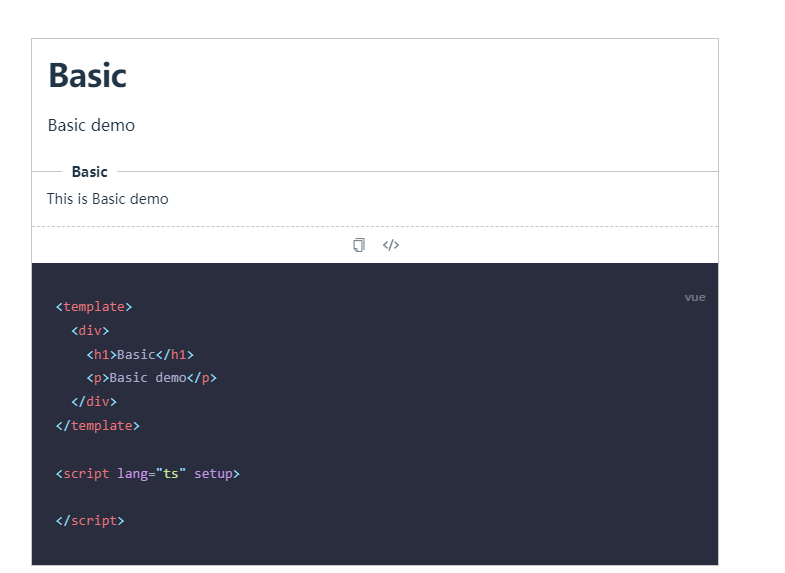

# vite-plugin-vitepress-demo

A vite plugin for vitepress code block demo.

English | [简体中文](./README.zh-CN.md)



## Install

```bash
npm i vite-plugin-vitepress-demo -D
```

## Plugin configuration

The plugin is Pure ESM, make sure your `package.json` contains `"type": "module"`.

In `vite.config.[jt]s`:

```ts
import { defineConfig } from 'vite'
import VitePluginVitepressDemo from 'vite-plugin-vitepress-demo'

export default defineConfig({
  plugins: [
    VitePluginVitepressDemo(),
  ],
})
```

### Plugin options

* glob: string | string[]

  Specify the files to be processed, support glob syntax, default to `./**/demos/*.vue`.

* base: string

  Specify the folder to listen from, default to `vite` config `root`.

* exclude: string[]

  Specify the files to be excluded, support glob syntax, default to `['**/node_modules/**', '**/dist/**', '**/build/**', '**/test/**', '**/tests/**', '**/__tests__/**']`. If you don't want to exclude `.vitepress`, you can set `exclude:[]`.

* markdown: Same to `vitepress` config `markdown`.

### Experimental

At present, the support for `jsx` is still in the experimental stage, and there may be some unstable places. If you find bug, you can submit an issue to us.

## Component configuration

We support custom component in `2.x` version.

But it needs to be consistent with our props.

If our built-in themes do not meet your needs, you can refer to our [default theme](https://github.com/yanyu-fe/vite-plugin-vitepress-demo/tree/main/src/components) to customize your own theme.

At the same time, everyone is welcome to submit PR to make our theme more perfect.


### Usage Component


In `.vitepress/theme/index.[jt]s`:

```ts
import type { Theme } from 'vitepress'
import DefaultTheme from 'vitepress/theme'
import { AntdTheme } from 'vite-plugin-vitepress-demo/theme'

export default {
  ...DefaultTheme,
  enhanceApp({ app }) {
    app.component('Demo', AntdTheme)
  },
} as Theme

```


### Usage In markdown

```md
<demo src="./demos/basic.vue" title="标题" desc="描述"></demo>
```


### Import Source Code

```md
<demo src="./demos/basic.vue" raw></demo>
```

### Usage markdown  In vue file


`demos/basic.vue`:


```vue
<docs>
---
title: Test Title
---

Hello World This is Test Docs block code in `docs.vue`.

</docs>

<template>
  <div>
    {{ msg }}
  </div>
</template>

<script lang="ts" setup>
import { ref } from 'vue'

const msg = ref('Hello World')
</script>

```


In `markdown`:

```md
<demo src="./demos/docs.vue"></demo>
```
