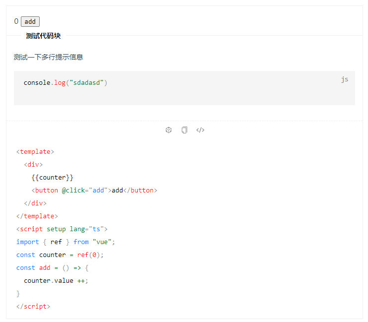

# vite-plugin-vitepress-demo

基于`vitepress`实现的自定义代码块的功能

```js
<demo codeSandbox="https://codesandbox.io/" src="./example/Test.vue" title="测试代码块">
    <span>测试一下</span>
    <desc>
    描述信息
    ```js
        console.log("js block")
    ```
    </desc>
</demo>
```




## 安装

```shell
yarn add vite-plugin-vitepress-demo
# or
npm i vite-plugin-vitepress-demo
```

## 使用

创建`.vitepress`在`config.ts`中引入

```ts
// config.ts
import { defineConfig } from "vitepress"
import { vitePluginVitepressDemo } from "vite-plugin-vitepress-demo"
export default defineConfig({
    vite:{
        plugins:[
            vitePluginVitepressDemo()
        ]
    }
})
```

创建`.vitepress/theme/index.ts`中使用代码块

```ts
// theme/index.ts
import ThemeDefault from "vitepress/dist/client/theme-default"
import { Theme } from "vitepress";
import "vite-plugin-vitepress-demo/dist/demo/code.css"
import DemoBlock from "vite-plugin-vitepress-demo/dist/demo/index.vue";

export default {
    ...ThemeDefault,
    enhanceApp:({app}) => {
        app.component('demo',DemoBlock);
    }
} as Theme
```

## 使用代码块

```html

<!--引入代码块：-->

<demo src="./example/Test.vue"></demo>

<!--增加标题-->

<demo src="./example/Test.vue" title="标题"></demo>

<!--增加描述-->
<demo src="./example/Test.vue" title="标题">
    <desc>代码描述`vue-test`</desc>
</demo>

<!--增加`codeSandbox`-->

<demo codeSandbox="https://codesandbox.io/" src="./example/Test.vue" title="测试" desc="描述信息`codeSandbox`"></demo>

<!--文件代码块-->
<demo src="./example/Test.ts"></demo>
<!--携带语言代码块-->
<demo src="./example/Test.ts" language="TypeScript"></demo>
<!--vue文件生成代码块-->
<demo src="./example/Test.vue" raw></demo>
```

## 属性
> 具体参数如下：

| 参数          | 描述                                                         | 默认值 |
| ------------- | ------------------------------------------------------------ | ------ |
| `src`         | 代码块地址                                                   | `-`    |
| `language`    | 语言，如果不传入，默认使用src的文件扩展名称                  | `-`    |
| `raw`         | 是否展示源代码，如果是非`vue`文件默认展示，如果是`vue`文件需要并且需要展示源代码，需要使用此属性 |        |
| `title`       | 标题                                                         | `-`    |
| `desc`        | 描述                                                         | `-`    |
| `codeSandbox` | 代码演示                                                     | `-`    |


## 自定义代码块

> 如果您想自定义代码块，您可以借鉴一下`vite-plugin-vitepress-demo/dist/demo/index.vue`中的写法，我们提供了如下的传参

| 参数          | 默认值 | 描述                                                 |
| ------------- | ------ | ---------------------------------------------------- |
| `codeSandbox` | -      | 跳转`codeSandbox`在线环境                            |
| `title`       | -      | 自定义标题，需要使用`decodeURIComponent`解码         |
| `desc`        | -      | 自定义描述信息，需要使用`decodeURIComponent`解码     |
| `highlight`   | -      | 需要高亮显示的代码，需要使用`decodeURIComponent`解码 |
| `copyCode`    | -      | 需要被复制的代码块，需要使用`decodeURIComponent`解码 |


## Options

```js
// config.ts
import { defineConfig } from "vitepress"
import { vitePluginVitepressDemo } from "vite-plugin-vitepress-demo"
export default defineConfig({
    vite:{
        plugins:[
            vitePluginVitepressDemo({
           		// 自定义编译模式
              transform:(code,id)=>code,
              // 自定义代码块名称，默认为demo，不建议使用code开头的标签，因为与vitepress默认的code冲突
              wrapper:"demo",
              // 支持编译的文件
              include: /\.md$/,
              // 需要被忽略的文件
              exclude: ''
            })
        ]
    }
})
```
